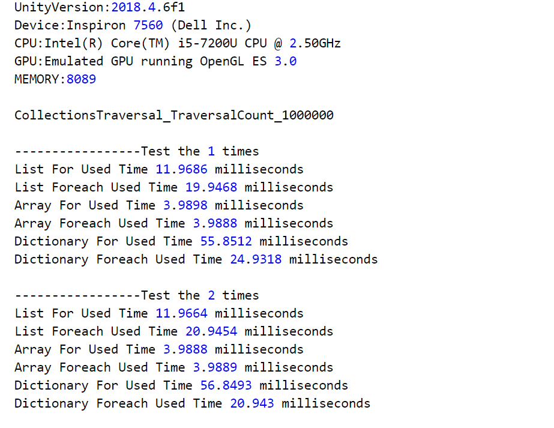

# UnityPerformanceTest

## Unity C#容器(Array, List, Dictionay)性能测试

### 测试条件

1. 平台环境: Unity2018.4 ，Window Android
2. 编译环境：IL2CPP
3. List，Array，Dictionay 3个容器，通过For和Foreach分别遍历100万次，记录执行时间，同时测试了5次，记录结果；
   由于Array数据比较近似，后面增加到遍历1000万次，也是测试了5次，记录结果。

### 测试结果 

1. Array效率高于List<T>, 如果固定长度数据，选择Array。
2. 遍历数据时Array采用Foreach，List<T>采用For的形式。
3. Dictionay如果遍历，采用foreach (var v in dictionary.Values)，同时dictionary.TryGetValue()消耗较大。
4. 容器选择很重要，前期数据结构设计好，减少cpu压力，避免cpu发热量过高导致掉帧。
5. 尽量减少在Update中每帧都通过容器遍历数据，同时避免在Update使用dictionary.TryGetValue()方法。
   
### 测试Log记录 [详细数据](TestLogs/)⁩   

#### Test Windows Editor

#### Test Android Platform(HuaiWei Honour Note 8) 

